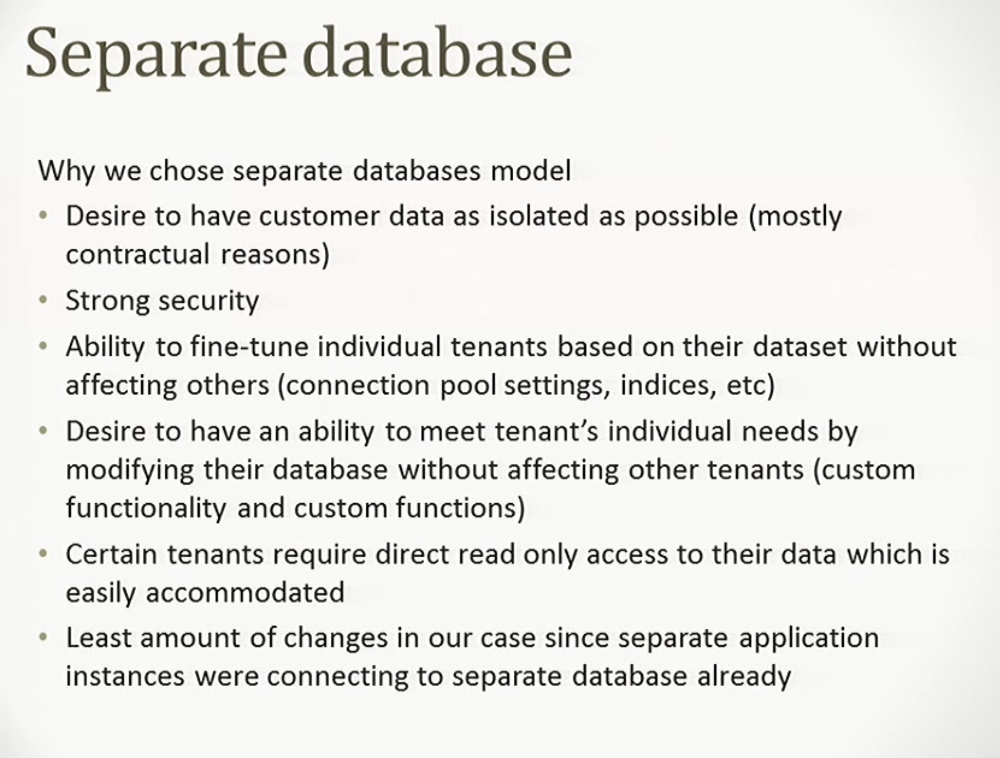

# awesome-multitenancy

This repository contains resources on Multitenant architecture.

## Articles & Tutorials

* Our Multi-tenancy Journey with Postgres Schemas and Apartment - [Link](https://influitive.io/our-multi-tenancy-journey-with-postgres-schemas-and-apartment-6ecda151a21f)
* Azure Multi-tenant SaaS database tenancy patterns - [Link](https://docs.microsoft.com/en-us/azure/sql-database/saas-tenancy-app-design-patterns)
* The Force.com Multitenant Architecture - [Link](https://developer.salesforce.com/page/Multi_Tenant_Architecture)
* Serverless enterprise-grade multi-tenancy using AWS - [Link](https://medium.com/@tarekbecker/serverless-enterprise-grade-multi-tenancy-using-aws-76ff5f4d0a23)
* Multi-Tenancy Implementation using Spring Boot + Hibernate - [Link](https://medium.com/swlh/multi-tenancy-implementation-using-spring-boot-hibernate-6a8e3ecb251a)
* Providing Multitenancy with Spring Boot - [Link](https://bytefish.de/blog/spring_boot_multitenancy/)
* Elegant Multi-Tenancy for Microservices — Part I: Why Bother? - [Link](https://medium.com/@Integral_io/elegant-multi-tenancy-for-microservices-part-i-why-bother-a88234f9d293)
* Monoliths, Microservices and Multitenancy  - [Link](https://blog.jacobsdata.com/2020/02/03/monoliths-microservices-and-multitenancy)

## Stackoverflow Questions

1. Multi tenant in a micro-service - [Link](https://softwareengineering.stackexchange.com/questions/399232/multi-tenant-in-a-micro-service)

## Talks

* Multi-tenant architecture at Atlassian in 20 minutes  - [Link](https://www.youtube.com/watch?v=0N4KknY_zdU)
* Deconstructing SaaS: Building Multi-Tenant Solutions on AWS - [Link](https://www.youtube.com/watch?v=mwQ5lipGTBI)
* Salesforce Multi Tenant Architecture: How We Do the Magic We Do - [Link](https://www.youtube.com/watch?v=Tuy_O37H3O8)
* Scaling Shopify's Multitenant Architecture Across Multiple Data Centres - [Link](https://www.youtube.com/watch?v=F-f0-k46WVk)
* Create and Deploy Multi Tenant Applications on Azure with Azure DevOps - [Link](https://www.youtube.com/watch?v=A9t4_OHXprA)

## Github Repositories

1. Spring Boot 2 Multi-Tenant Example - [Link](https://github.com/jkutner/spring-boot-multi-tenancy)
2. stancl/tenancy: Automatic multi-tenancy for Laravel - [Link](https://github.com/stancl/tenancy)

## Images

